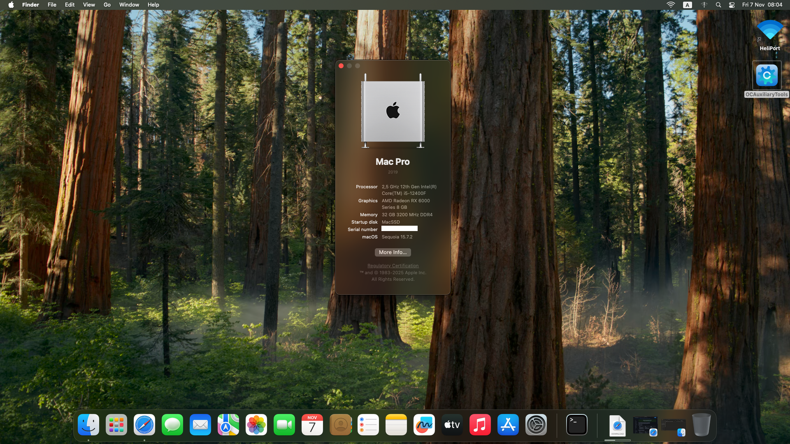
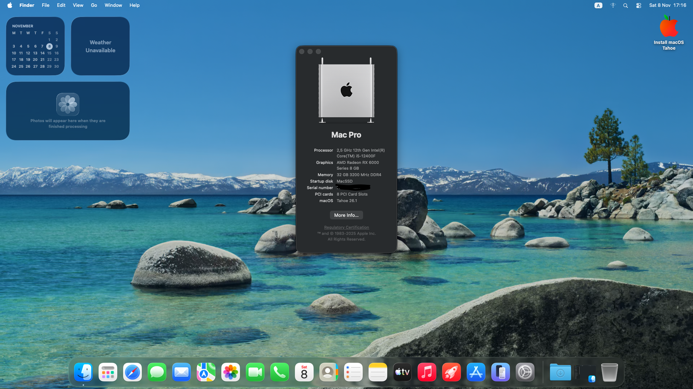

  
  

# OpenCore EFI Configuration

> ⭐ **If this EFI helps you, please give this repository a star!**

This repository contains an OpenCore EFI configuration for a Hackintosh setup.

## Hardware Configuration

### 1. CPU
- **12th Gen Intel(R) Core(TM) i5-12400F**

### 2. GPU
- **AMD Radeon RX 6600 LE**
  - Connected Monitor: VA2432 100Hz (HDMI)

### 3. Sound
- **Realtek(R) Audio**
  - Audio Endpoint: Realtek HD Audio 2nd output
- **AMD High Definition Audio Device**
  - Audio Endpoint: 1 - VA2432 100Hz

### 4. Network
- **Intel(R) Dual Band Wireless-AC 8260**
  - Continuity Support: Partial (Handoff and Universal Clipboard with AirportItlwm)
  - Note: AirDrop, Universal Clipboard, Instant Hotspot,... not available
- **Realtek PCIe GbE Family Controller**

### 5. Storage Controllers
- **Alder Lake-S PCH SATA Controller [AHCI Mode]**
- **WD Black SN770 / PC SN740 256GB / PC SN560 (DRAM-less) NVMe SSD**

### 6. Bluetooth
- **Intel(R) Wireless Bluetooth(R)**

## BIOS Settings

**Important:** In most cases, just a BIOS difference could lead to boot loop. So read this carefully.

### Disable:
- Fast Boot
- Secure Boot
- Serial/COM Port
- Parallel Port
- VT-d
- Compatibility Support Module (CSM)
- Intel SGX
- Intel Platform Trust

### Enable:
- VT-x
- Above 4G decoding
- Hyper-Threading
- Execute Disable Bit
- EHCI/XHCI Hand-off
- OS type: Windows 8.1/10 UEFI Mode
- SATA Mode: AHCI

## Tested macOS Versions

This configuration has been tested and confirmed working on:
- macOS Monterey
- macOS Sequoia
- macOS Tahoe

## Kexts Included

- AirportItlwm.kext - Intel Wi-Fi support
- AppleALC.kext - Audio support
- BlueToolFixup.kext - Bluetooth fixes
- IntelBluetoothFirmware.kext - Intel Bluetooth firmware
- IntelBTPatcher.kext - Intel Bluetooth patcher
- itlwm.kext - Alternative Intel Wi-Fi driver
- Lilu.kext - Plugin loader
- NootRX.kext - AMD RX 6600 support
- NVMeFix.kext - NVMe SSD fixes
- RealtekRTL8111.kext - Realtek Ethernet support
- RestrictEvents.kext - Event restrictions
- SMCProcessor.kext - CPU monitoring
- SMCSuperIO.kext - Super I/O monitoring
- USBToolBox.kext - USB mapping tool
- UTBDefault.kext - USB tool defaults
- VirtualSMC.kext - SMC emulation
- XHCI-unsupported.kext - XHCI controller support

## ACPI Files

- SSDT-EC.aml - Embedded Controller
- SSDT-PLUG-ALT.aml - CPU power management
- SSDT-RHUB.aml - USB reset hub
- SSDT-RTCAWAC.aml - RTC wake fix
- SSDT-SBUS.aml - SMBus support
- SSDT-USB-Reset.aml - USB reset
- SSDT-USBX.aml - USB power management

## Disclaimer

This EFI configuration is provided as-is. Use at your own risk. Make sure to backup your original EFI folder before using this configuration.

---

# Cấu hình OpenCore EFI

> ⭐ **Nếu EFI này giúp được bạn, hãy cho repository này một sao nhé!**

Repository này chứa cấu hình OpenCore EFI cho thiết lập Hackintosh.

## Cấu hình phần cứng

### 1. CPU
- **12th Gen Intel(R) Core(TM) i5-12400F**

### 2. GPU
- **AMD Radeon RX 6600 LE**
  - Màn hình kết nối: VA2432 100Hz (HDMI)

### 3. Âm thanh
- **Realtek(R) Audio**
  - Điểm cuối âm thanh: Realtek HD Audio 2nd output
- **AMD High Definition Audio Device**
  - Điểm cuối âm thanh: 1 - VA2432 100Hz

### 4. Mạng
- **Intel(R) Dual Band Wireless-AC 8260**
  - Hỗ trợ Continuity: Một phần (Handoff và Universal Clipboard với AirportItlwm)
  - Lưu ý: AirDrop, Universal Clipboard, Instant Hotspot,... không khả dụng
- **Realtek PCIe GbE Family Controller**

### 5. Bộ điều khiển lưu trữ
- **Alder Lake-S PCH SATA Controller [AHCI Mode]**
- **WD Black SN770 / PC SN740 256GB / PC SN560 (DRAM-less) NVMe SSD**

### 6. Bluetooth
- **Intel(R) Wireless Bluetooth(R)**

## Cài đặt BIOS

**Quan trọng:** Trong hầu hết các trường hợp, chỉ một sự khác biệt về BIOS có thể dẫn đến boot loop. Vì vậy hãy đọc kỹ phần này.

### Tắt:
- Fast Boot
- Secure Boot
- Serial/COM Port
- Parallel Port
- VT-d
- Compatibility Support Module (CSM)
- Intel SGX
- Intel Platform Trust

### Bật:
- VT-x
- Above 4G decoding
- Hyper-Threading
- Execute Disable Bit
- EHCI/XHCI Hand-off
- OS type: Windows 8.1/10 UEFI Mode
- SATA Mode: AHCI

## Phiên bản macOS đã kiểm tra

Cấu hình này đã được kiểm tra và xác nhận hoạt động trên:
- macOS Monterey
- macOS Sequoia
- macOS Tahoe

## Kexts được bao gồm

- AirportItlwm.kext - Hỗ trợ Wi-Fi Intel
- AppleALC.kext - Hỗ trợ âm thanh
- BlueToolFixup.kext - Sửa lỗi Bluetooth
- IntelBluetoothFirmware.kext - Firmware Bluetooth Intel
- IntelBTPatcher.kext - Bộ vá Bluetooth Intel
- itlwm.kext - Driver Wi-Fi Intel thay thế
- Lilu.kext - Trình tải plugin
- NootRX.kext - Hỗ trợ AMD RX 6600
- NVMeFix.kext - Sửa lỗi ổ SSD NVMe
- RealtekRTL8111.kext - Hỗ trợ Ethernet Realtek
- RestrictEvents.kext - Hạn chế sự kiện
- SMCProcessor.kext - Giám sát CPU
- SMCSuperIO.kext - Giám sát Super I/O
- USBToolBox.kext - Công cụ ánh xạ USB
- UTBDefault.kext - Mặc định công cụ USB
- VirtualSMC.kext - Mô phỏng SMC
- XHCI-unsupported.kext - Hỗ trợ bộ điều khiển XHCI

## Tệp ACPI

- SSDT-EC.aml - Embedded Controller
- SSDT-PLUG-ALT.aml - Quản lý nguồn CPU
- SSDT-RHUB.aml - USB reset hub
- SSDT-RTCAWAC.aml - Sửa lỗi RTC wake
- SSDT-SBUS.aml - Hỗ trợ SMBus
- SSDT-USB-Reset.aml - Reset USB
- SSDT-USBX.aml - Quản lý nguồn USB

## Tuyên bố miễn trừ trách nhiệm

Cấu hình EFI này được cung cấp như hiện tại. Sử dụng có rủi ro của riêng bạn. Hãy đảm bảo sao lưu thư mục EFI gốc của bạn trước khi sử dụng cấu hình này.

